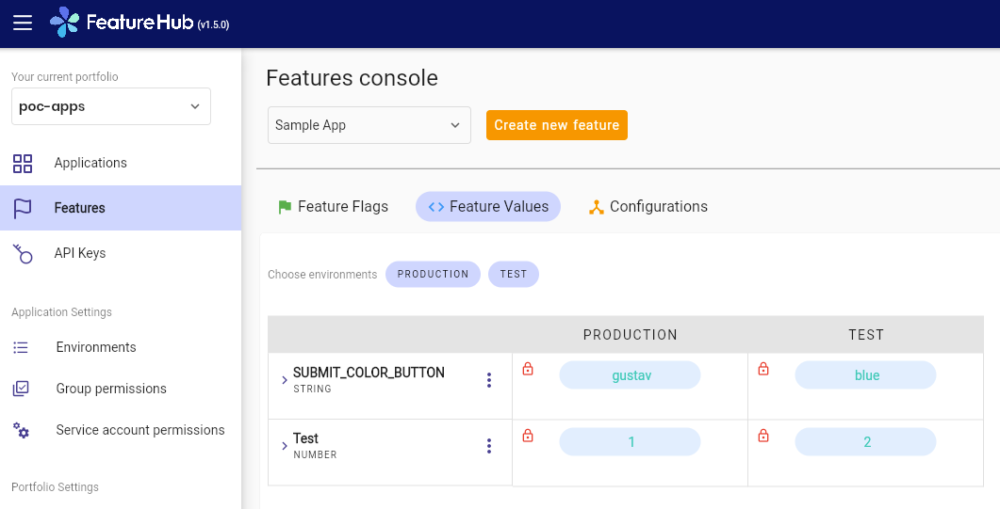

# PoC for feature toggle using [featurehub.io](https://www.featurehub.io/)

## execute server using following command: 
`docker run -p 8085:8085 --user 999:999 featurehub/party-server:latest`

## logon and create toggle
- http://localhost:8085/
- create feature toggle named 'SUBMIT_COLOR_BUTTON'
  ___!!It is important that applied value has been locked. Otherwise it's not considered.!!___
  

## build sample-java-springboot
`mvn clean install -f ./sample-java-springboot/pom.xml`

## run application
- following env params are required
  ```
  FEATUREHUB_EDGE_URL=http://localhost:8085/
  FEATUREHUB_API_KEY=default/3f7a1a34-642b-4054-a82f-1ca2d14633ed/aH0l9TDXzauYq6rKQzVUPwbzmzGRqe*oPqyYqhUlVC50RxAzSmx
  ```
- use client key from feature hub server
  

## Finally test by following url: `curl http://localhost:8080`

